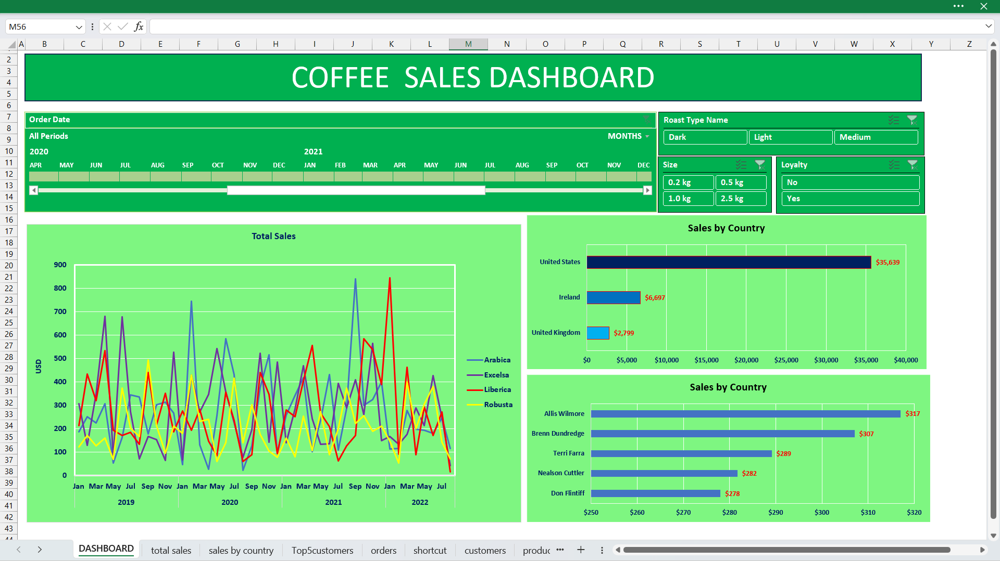
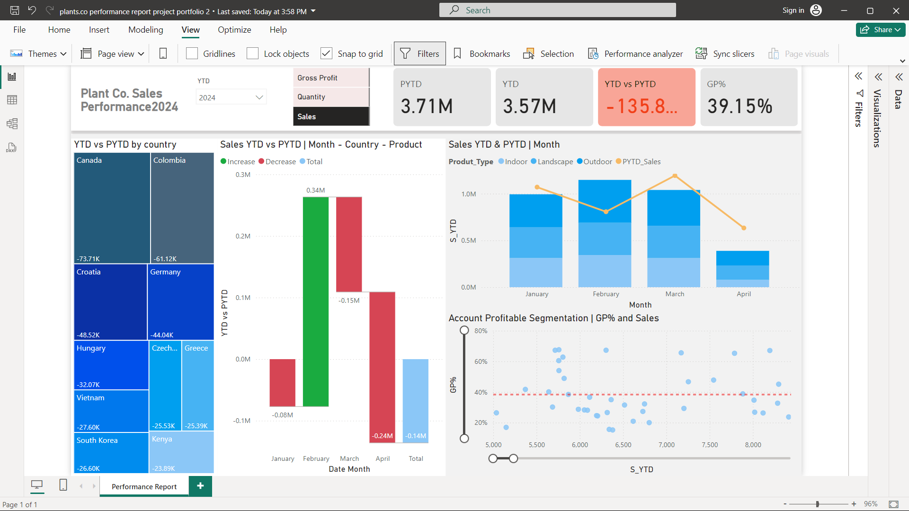
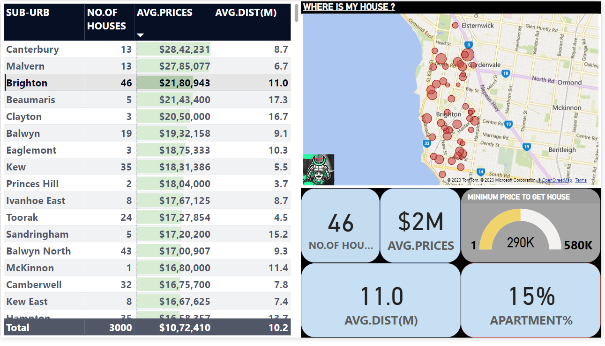
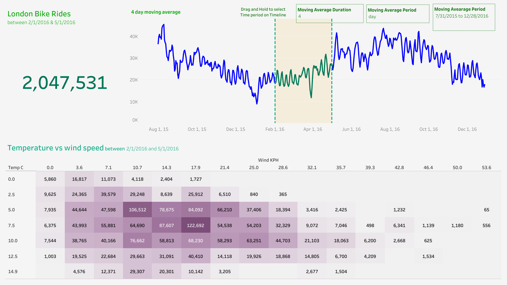

# 👋 Hello, I'm [GokulaKrishnan ]!

🚀 Aspiring **Data Analyst** with expertise in **MySQL, Python, MS Excel, and Power BI**, passionate about transforming raw data into meaningful insights. 

## 🔧 Technologies & Tools
- 🐍 Python (Pandas, NumPy, Matplotlib)
- 🗄️ MySQL
- 📊 Power BI
- 📈 MS Excel (Advanced)
- 🔎 Data Cleaning & Analysis
- 📉 Data Visualization

## 💼 Real-Time Projects

### 1. Coffee Sales Dashboard (MS Excel)

Created an Excel dashboard to track sales KPIs dynamically, visualizing revenue, products, and regional performance.

---

### 2. Plant.Co Sales Data Visualization (Power BI)

Developed an interactive Power BI dashboard to visualize sales performance metrics and trends.

---

### 3. Melbourne Housing Market Analysis (Power BI)

Analyzed housing trends and pricing patterns in Melbourne, showcasing insights through advanced data visualization.

---

### 4. London Bike Rides Analysis (Python)

Performed data manipulation and statistical analysis on bike ride patterns using Python libraries (Pandas, Matplotlib).

---

## 🎯 What I’m Currently Focusing On:
- 🌱 Learning more about **Machine Learning** and **AI** concepts
- 📚 Exploring advanced data modeling techniques
- 🔄 Contributing to open-source data analytics projects

## 📫 Let’s Connect!
- [LinkedIn](https://www.linkedin.com/in/gokula-krishnan-s-70a824212) 
- [Portfolio Website](https://gokulkrish1045.github.io/goku1045/)
- 📧 Email: gokulkri1045@gmail.com

---

💡 *“Turning data into actionable insights is not just a skill; it’s an art of storytelling through numbers.”*

