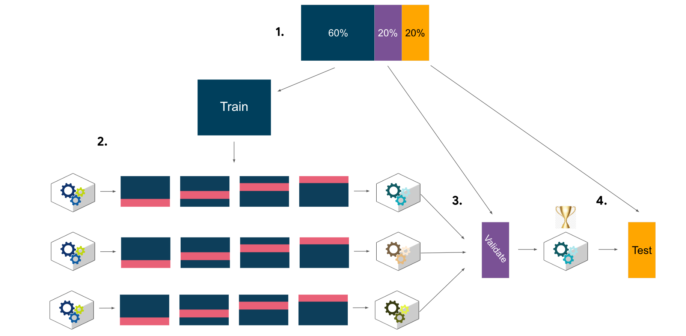
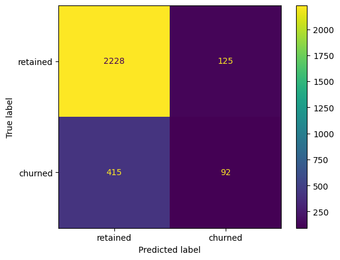
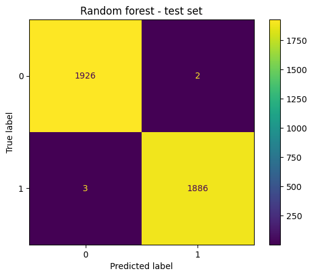

# 👋 Hello, I'm GokulaKrishnan !

🚀 Aspiring **Data Analyst** with expertise in **MySQL, Python, MS Excel, and Power BI**, passionate about transforming raw data into meaningful insights. 

## 🔧 Technologies & Tools
- 🐍 Python (Pandas, NumPy, Tensorflow, Pytorch, Matplotlib, Seaborn)
- 🗄️ MySQL
- 📊 Power BI
- 📈 MS Excel (Advanced)
- 🔎 Data Cleaning & Analysis
- 📉 Data Visualization
- ⚙️ Feature Engineering , Hypothesis Testing , ML Model Building

## 💼 Real-Time Projects

### 1. WAZE Customer Churn Prediction Using ML models(Python,sklearn,logistic_regression,Tree_classification)

MODEL SELECTION FOR TREE CLASSIFICATION:

CHAMPION MODEL XGBOOST CONFUSION MATRIX:

A data-driven churn prediction project analyzing user engagement patterns from a Waze-like navigation app to identify high-risk users using SQL and Python.

---
### 2. CNN LSTM Image Caption Generator (Python)

An image caption generation project that utilizes deep learning models (CNN and RNN) to generate descriptive captions for images from the Flickr dataset

---
### 3. TIK-TOK Video Opinion vs. Claim PREDICTION  (Python)

The champion model is Random forest :

The upper-left quadrant displays the number of true negatives: the number of opinions that the model accurately classified as so.

The upper-right quadrant displays the number of false positives: the number of opinions that the model misclassified as claims.

The lower-left quadrant displays the number of false negatives: the number of claims that the model misclassified as opinions.

The lower-right quadrant displays the number of true positives: the number of claims that the model accurately classified as so.

Built a machine learning model to classify TikTok user-generated content as opinions or factual claims using natural language processing and supervised learning techniques.

---
### 4. Coffee Sales Dashboard (MS Excel)

Created an Excel dashboard to track sales KPIs dynamically, visualizing revenue, products, and regional performance.

---

### 5. Plant.Co Sales Data Visualization (Power BI)

Developed an interactive Power BI dashboard to visualize sales performance metrics and trends.

---

### 6. Melbourne Housing Market Analysis (Power BI)

Analyzed housing trends and pricing patterns in Melbourne, showcasing insights through advanced data visualization.

---

### 7. London Bike Rides Analysis (Python)

Performed data manipulation and statistical analysis on bike ride patterns using Python libraries (Pandas, Matplotlib).

---

### 8. Netflix Movies and Webseries Analysis (My SQL)

Performed data manipulation and statistical analysis on Netflix Movies and Webseries Database

---

## 🎯 What I’m Currently Focusing On:
- 🌱 Learning more about **Machine Learning** and **AI** concepts
- 📚 Exploring advanced data modeling techniques
- 🔄 Contributing to open-source data analytics projects

## 📫 Let’s Connect!
- [LinkedIn](www.linkedin.com/in/gokula-krishnan-senthilkumar-70a824212) 
- [Portfolio Website](https://gokulkrish1045.github.io/goku1045/)
- 📧 Email: gokulkri1045@gmail.com

---

💡 *“Turning data into actionable insights is not just a skill; it’s an art of storytelling through numbers.”*

